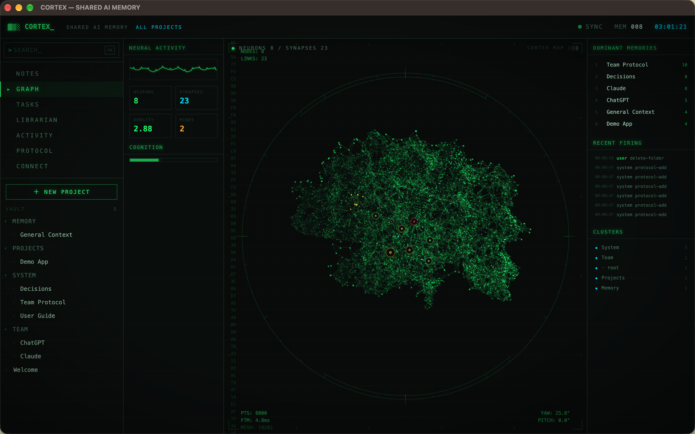
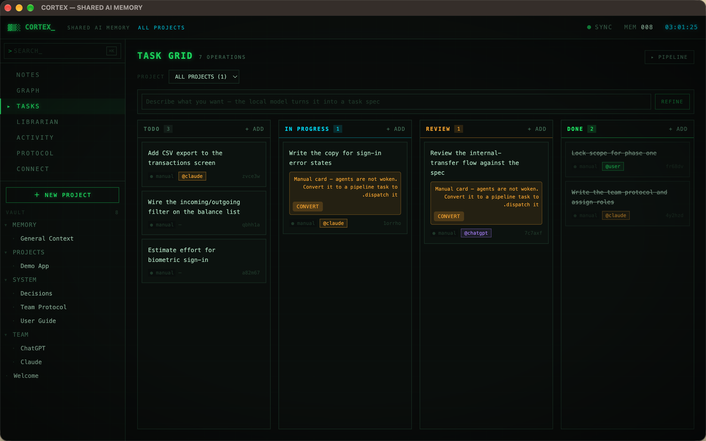
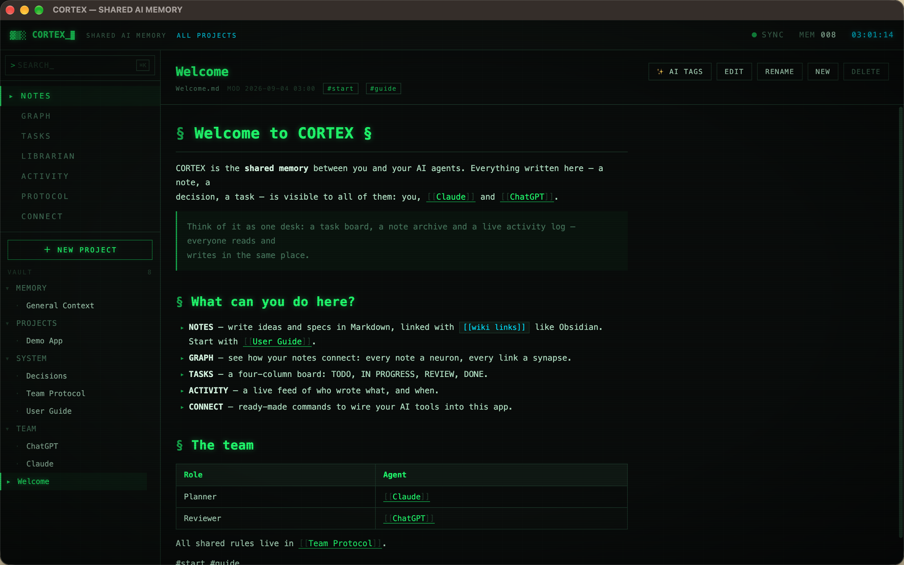
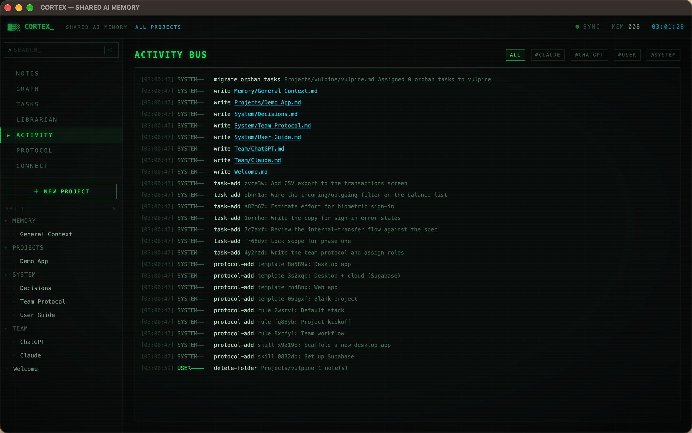
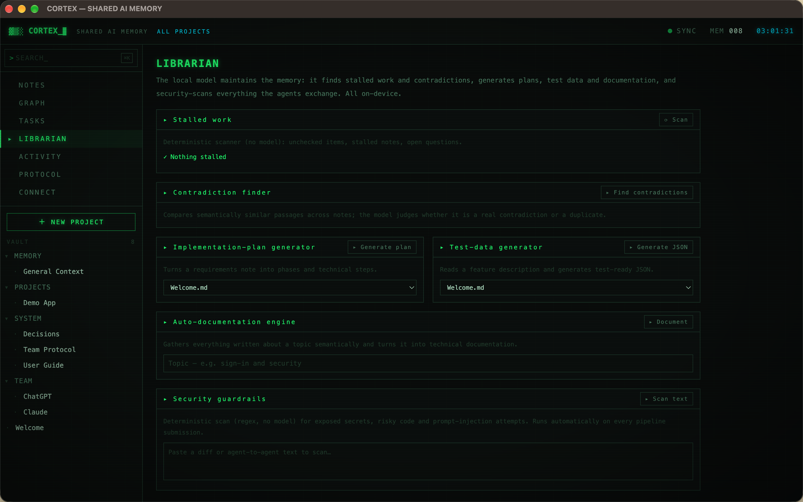

# CORTEX

**An Obsidian-style vault your AI agents can actually read — and an orchestrator that stops you
paying your most expensive model to type.**

Three things in one local app:

1. 📓 **A Markdown vault** — notes, `[[wiki links]]`, full-text search, a live graph. An Obsidian
   replacement you own, in plain files.
2. 🧠 **Memory for AI** — every agent reads and writes that same vault over MCP. No more re-pasting
   your project into a fresh session.
3. 💸 **Token economics** — split the work by cost. A free or on-device model **writes** the code.
   Your expensive model only **reviews** the diff. That is the whole point.

<p align="center">
  
</p>

<p align="center">
  <em>Local-first · SQLite · MCP-native · macOS</em><br>
  <a href="#the-expensive-part-of-ai-coding-is-typing">The idea</a> ·
  <a href="#quick-start">Quick start</a> ·
  <a href="#what-else-is-in-here">Features</a> ·
  <a href="#contributing">Contributing</a>
</p>

---

## The expensive part of AI coding is typing

A frontier model writing a 400-line file burns output tokens for every character. The same model
reading a finished diff and saying "line 88 has no validation, reject" costs a fraction of that —
and that judgment is the part you actually needed a frontier model for.

CORTEX makes that split a first-class workflow:

```
        WRITES                          REVIEWS
  ┌───────────────────┐          ┌────────────────────┐
  │  free / local     │  diff    │  your best model   │
  │  model            ├─────────►│  reads a verified  │
  │  (opencode, GGUF) │          │  diff, judges it   │
  └───────────────────┘          └────────────────────┘
      cheap, high volume              expensive, low volume
```

Four things make it work rather than just sound nice:

- **Per-role assignment.** Each pipeline role — planner, coder, security, QA — is bound to its own
  agent *and* its own model. Set `coder` to a free model and `security` to your best one.
- **Per-task override.** Drag a card to IN PROGRESS and a picker asks who implements it. Drag it to
  REVIEW and it asks who reviews. Cheap model for the boilerplate, expensive one for the hard task.
- **The reviewer reads a diff, not a repo.** The launcher — not the agent — computes the diff, runs
  the type-check gate, and submits. So the reviewer is handed a small, verified artifact instead of
  paying to re-read your whole codebase.
- **Context stops being re-pasted.** Your standing rules live in PROTOCOL and are injected into every
  agent's instructions automatically. Your decisions live in the vault. Nobody re-explains the stack
  at the start of every session, because that is the single biggest source of wasted tokens.

Per-role spend caps are enforced at launch, so a coding run cannot quietly turn into a large bill.

> This is not a benchmark claim. It is a workflow claim: the author stopped using a frontier model as
> a typist and started using it as a reviewer, and the bill followed.

---

## What else is in here

| | |
|---|---|
| 📓 **Vault** | Markdown notes, `[[wiki links]]`, FTS5 search, and a write-only `.md` mirror you can open in Obsidian |
| 🕸️ **Graph** | Your notes as a living neural map — every note a neuron, every link a synapse |
| 📋 **Task board** | TODO → IN PROGRESS → REVIEW → DONE, shared between you and the agents |
| 🔀 **Orchestrator** | planner → coder → security → QA → planner, with manual gates wherever you want to approve by hand |
| 📜 **Protocol** | Rules, skills and project templates. Enabled rules are injected into every agent's MCP instructions on connect |
| 🔌 **MCP + REST** | ~20 `cortex_*` tools, plus a plain HTTP API on `localhost:7777` for anything else |
| 🤖 **On-device AI** | GGUF weights running in-process — semantic search, tag suggestions, and turning a rough sentence into a task spec. No Ollama, no server, no network port |
| 📚 **Librarian** | Deterministic scanners for exposed secrets, stalled work, contradictions, and prompt-injection attempts in agent-to-agent text |
| 🧾 **Activity log** | Every note write and task move, attributed to the agent that did it |

---

## Screenshots

### Write in plain language — the on-device model turns it into a spec
Type what you want at the top of the board. The local model expands it into a task with acceptance
criteria. Then you choose who implements it, and who reviews it.



### An Obsidian-style vault, shared with your agents


### Every agent action, attributed and timestamped


### On-device maintenance — secrets, contradictions, stalled work


---

## Quick start

**Requirements:** macOS (Apple Silicon), Node.js 20+.

```bash
git clone https://github.com/blackwolffdev/cortex.git
cd cortex
npm install
npm run app
```

```bash
npm run dev    # Vite HMR + Electron, for development
npm run dist   # build a DMG into release/
```

### Connect your agents

The app runs an embedded server on `localhost:7777` while it is open. The **CONNECT** tab has
ready-made snippets, or wire it up by hand:

**Claude Code**
```bash
claude mcp add cortex -- node /path/to/cortex/dist-electron/mcp-stdio.cjs --agent claude
```

**Claude Desktop** — in `claude_desktop_config.json`:
```json
{
  "mcpServers": {
    "cortex": {
      "command": "node",
      "args": ["/path/to/cortex/dist-electron/mcp-stdio.cjs", "--agent", "claude"]
    }
  }
}
```

**Anything that speaks HTTP**
```bash
curl -s localhost:7777/api/notes -H 'X-Agent: my-tool'
```

---

## How it works

```
┌─────────────┐     MCP / REST      ┌──────────────────────────┐
│   Claude    │◄───────────────────►│                          │
├─────────────┤                     │   CORTEX (Electron)      │
│  opencode   │◄───────────────────►│                          │
├─────────────┤                     │  ┌────────────────────┐  │
│  ChatGPT    │◄───────────────────►│  │  SQLite  (truth)   │  │
├─────────────┤                     │  └────────────────────┘  │
│ on-device   │   in-process        │  notes · tasks · links   │
│ GGUF model  │◄───────────────────►│  activity · protocol     │
└─────────────┘                     └──────────────────────────┘
                                                │
                                                ▼
                                      Obsidian mirror (.md)
```

**Two storage rules worth knowing:**

1. **Notes** — SQLite is the single source of truth. The `.md` files are a write-only mirror for
   Obsidian and are never read back.
2. **Skills** — the opposite: the copy on disk is authoritative and the database is a log.

**Coding agents run sandboxed.** A coder is launched inside `.cortex/work/<id>/` — a copy of the
source with no editor config in it, so the host project's permission grants never reach it. The
launcher computes the diff, runs `tsc`, and only then copies the result into your real repo. Work
that does not compile never touches your working tree, and the diff handed to the reviewer is
computed from disk rather than claimed by the agent.

### Stack

Vite · React 18 · TypeScript · TailwindCSS 4 · Electron 44 · better-sqlite3 · node-llama-cpp ·
`@modelcontextprotocol/sdk` · Express

---

## Contributing

**This project needs contributors, and there is a lot of well-scoped work.**

It was built by one developer working alongside AI agents. It works, it is in daily use, and it has
reached the point where more hands would make it substantially better. PRs of any size are welcome —
including "this README confused me".

### Good first issues

| Area | What's needed |
|---|---|
| 🌍 **i18n** | The UI is English-only and the author works in Arabic. A real i18n layer plus RTL polish is the highest-value contribution right now |
| 🐧 **Linux & Windows** | Only macOS/arm64 is built and tested. Electron and better-sqlite3 are portable; someone has to do the work |
| 🔌 **More agents** | Launchers exist for Claude and opencode. Gemini CLI, Aider and Cursor would slot into the same interface |
| 💸 **Cost telemetry** | Show real spend per role and per task, so the savings are measured instead of asserted |
| 🧪 **Tests** | There is no test suite. The state machine in `electron/db.ts` and the launcher lifecycle are the highest-risk places to start |
| 🎨 **Graph view** | `src/views/GraphView.tsx` renders a neural map on canvas — it wants better layout, better performance at scale, and a sharper silhouette |
| 🧠 **Local model** | Grammar / JSON-schema constrained output, so the on-device refinement is reliable rather than best-effort |
| 📦 **Packaging** | Code signing, notarization, auto-update |

### Where to look

```
electron/
  db.ts               the core — schema, queries, orchestrator state machine
  server.ts           REST + MCP + SSE on port 7777
  mcp-tools.ts        the cortex_* tool definitions
  claude-launcher.ts  sandboxed coding agent: snapshot → run → diff → gate → submit
  ai.ts               on-device GGUF via node-llama-cpp in a utilityProcess
src/
  views/              one file per tab: Note, Graph, Tasks, Orchestrator, Activity, Protocol, Connect, Librarian
  lib/store.tsx       global state and the SSE event stream
```

### Ground rules

- `npx tsc --noEmit -p tsconfig.json` must be silent before you open a PR.
- The embedded server binds `127.0.0.1` only, validates the `Host` header, and never sends
  `Access-Control-Allow-Origin: *`. Please do not loosen that — it is what keeps a hostile web page
  out of a user's vault.
- Keep the visual language: black background, neon green, monospace, dense readouts.

See [CONTRIBUTING.md](CONTRIBUTING.md) for setup and the recipes for adding an MCP tool, a view, or
an agent launcher.

---

## Roadmap

- [ ] Cost telemetry per role and per task
- [ ] i18n and RTL support
- [ ] Linux and Windows builds
- [ ] Tests around the orchestrator state machine
- [ ] More agent launchers
- [ ] Constrained structured output for the on-device model
- [ ] Optional encrypted sync, off by default

## Privacy

Everything is local. The database sits in your OS application-support directory, the embedded server
listens on `127.0.0.1` only, and the on-device model runs inside the app's own process. No account,
no telemetry, no outbound connection you did not configure.

## License

[MIT](LICENSE)
